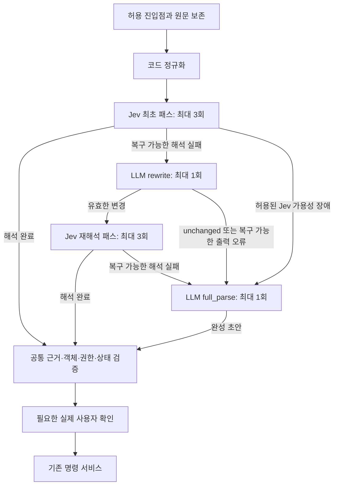

# 1.2.0 — Jev와 교체 가능한 LLM으로 자연어 해석기 재구성

- 상태: **IN_PROGRESS — 단계별 구현·LXC 검증 및 GitHub 개발 체크포인트 진행**
- 작성일: 2026-09-28, Asia/Seoul
- 요청: ReconstructionPhase 아키텍처 구현과 각 단계 `v1.2.0-p1`부터 GitHub 반영. [실행 기록](../../../evidence/public/reconstruction-120-progress.md)에 실제 결과와 제한을 남긴다.
- 기준: [해석기 설계서 v1.3](../changgeun_jev_llm_fallback_command_parser_spec_v1.3.md), [기존 명세](../../CHANGGEUN_DEVELOPMENT_SPEC_v1.3.md), [1.1.8 상태](../../1.PatchPhase/1.1.8/README.md), [결정0010](../../../docs/decisions/0010-reconstruction-parser-plan.md).
- 소스 기준: `474dad904466f0cce0817f7ac2527e4b86d9264c`. 현재 작업은 문서 작성이며 이 SHA의 제품 코드를 변경하지 않는다.

## 목표와 범위

`!!창근아`와 기존 자연어 진입점의 요청을 등록된 **한 명령과 정확한 전체 인수**로 해석한다. 보통 Jev에서 끝내고, 표현 해석 실패에만 GPT 재작성과 최종 해석을 사용한다. 모델이 실행 권한을 가지거나 실제 없는 값을 만들어 채우지 못하도록 원문 근거·객체·권한·확인 검증을 한 경로로 모은다.

누락·모호함은 질문으로, 권한/범위 오류는 거부로 종료한다. 그림에서 생략한 거절·취소·통신 오류·마감시간 분기는 [08단계](08_rewrite_and_fallback_orchestration.md)의 전이표를 따른다. 정식 슬래시·버튼·등록된 구조화 제어는 모델0회다.

명령 범위는 [C01~C47·I01~I08](../../1.PatchPhase/1.1.8/COMMAND_COVERAGE.md)와 공개 옵션이다. C39는 동일 파서의 진입점이며 재귀 명령 후보가 아니다. 재생·목록·제안·주시·운영 기능과 역할/채널 정책을 보존하고, 자연어와 슬래시가 같은 서비스를 사용하게 한다. 일반 채팅 기억, 복합 명령의 연속 실행, 새 음악 기능, OpenJev 재도입은 이 버전 범위가 아니다. Gemini/Luna는 교체 계약의 대상이며 초기 실제 어댑터는 GPT-5 nano와 `disabled`만 계획한다.

## 단계별 계획

사용자 후속 지시에 따라 **기존 재생목록·곡목록·채널목록처럼 목록을 조회하거나 만들 수 있는 인수는 실제 목록 전달을 기본으로 한다.** Jev가 문장에서 추측한 객체 후보 대신 권한 범위 안의 전체 목록을 보고 항목을 선택한다. 새 이름·검색어만 원문에서 추출한다. 목록이 너무 크면 범위를 묻거나 선택 화면으로 좁히며 임의 top-k/잘림으로 대체하지 않는다. [04단계](04_typed_candidates_and_resolution.md)에 목록 스냅샷·완전성·변경 검증을 정했다. 이 보완은 원본 명세의 일반 후보 생성 설명보다 우선한다.

| 단계 | 문서 | 선행 | 종료 기준 |
| --- | --- | --- | --- |
| 01 | [기준선·계약·이관 설계](01_baseline_and_contracts.md) | 없음 | 현재/목표 차이, 명령·데이터·예산 소유권과 새 계약 확정 |
| 02 | [명령 등록부·공통 서비스](02_registry_and_command_service.md) | 01 | 공개 명령·옵션·화면 전수 대응과 실행 동등성 |
| 03 | [원문 보존·정규화](03_normalizer_and_provenance.md) | 01, 02 | 보호 구간·Unicode source map·무모델 정규화 |
| 04 | [실제 목록 전달·원문 값 추출](04_typed_candidates_and_resolution.md) | 02, 03 | 실제 목록의 범위/완전성·선택 소속, 새 값의 원문 근거 |
| 05 | [게이트웨이·공통 예산](05_gateway_budget_and_api_migration.md) | 01, 02 | 신규 API/원장, 패스별3·전체8회·기한·취소 보장 |
| 06 | [Jev 패스·질문 묶음](06_jev_interpreter.md) | 04, 05 | 명령/인수/조건부 조회를 같은 해석기로 두 패스 지원 |
| 07 | [LLM 프로필·GPT 어댑터](07_llm_provider_profiles.md) | 02, 04, 05 | rewrite/full_parse 계약·엄격 스키마·교체/disabled |
| 08 | [rewrite·최종 폴백 조정](08_rewrite_and_fallback_orchestration.md) | 03, 04, 06, 07 | 복구 전이·종료·원문 검증·무재귀 동작 |
| 09 | [검증·후속 대화·Discord](09_validation_dialogue_and_discord.md) | 02, 08 | 같은 실행 검증·실제 확인·단회 문맥·비공개 응답 |
| 10 | [구조화 로그·7일 보관](10_structured_logs_and_retention.md) | 01, 05, 08, 09 | 별도 trace DB·usage·정확한 만료·원장 보존 |
| 11 | [LXC 회귀·독립 평가·이관](11_lxc_evaluation_and_migration.md) | 01~10 | 고정 후보의 기능/안전/한국어/성능/복귀 증거 |
| 12 | [Discord 인수·전환·모델 수명](12_discord_rollout_and_model_lifecycle.md) | 11 | 동일 후보 실제 인수·제한 적용·복귀·상태 판정 |

번호는 권장 구현 순서이며 표의 선행은 필요한 계약·코드·초기 회귀의 준비를 뜻한다. 03/05, 06/07은 선행 계약이 확정되면 병렬 개발할 수 있다. 10의 trace 스키마와 이벤트 포트는 01/05부터 정의하고 각 단계에 계측을 넣는다. **실제 유료 호출은 10의 최소 마스킹·사용량 관측과 05의 지출 한도 검증을 먼저 통과해야 한다.** 07/08의 초기 검증은 LXC 테스트 대역으로 수행한다.07 실호출은11,09 실제 Discord는12에서 최종 증거를 연결하므로 후속 구현 착수와 전체VERIFIED 판정을 구분한다.

## 현재 기준선과 인수 경계

기록상 활성 봇은 `patch117b`, 중계는 `patch116g`다. `patch118a`는 소스/휠 개발 시험만 수행한 미적용 후보다. 이번 계획 작성에서 LXC 상태를 다시 조회하지 않았다. [1.1.8 개발 증거](../../../evidence/public/patch-118-development-20260928.md)의 369개 시험 및 의도45/46은 신규 구조의 인수 근거가 아니다.

1.1.8의 전수 옵션·typed continuation·독립221문장·실제 Discord 미완료는 02/04/09/11/12로 이관한다. 1.1.6 품질 FAIL과 1.1.7 PCM/음성/운영 미완료는 [STATUS](STATUS.md)에 따로 남긴다. 사용자 지정 **백업 검증 SKIPPED**를 완료로 바꾸거나 새 백업 인수를 자동 요구하지 않는다.

제품 설치·lint·타입·빌드·mock·DB·API·음성 검증은 **DiscordBotLXC만** 사용한다. 로컬은 문서/코드 작성과 저장소 파일 검사만 허용한다. 계획 작성으로 실제 GPT 호출·서비스 전환·기존3000 예산 증액·VERSION/출시 태그 변경을 수행하지 않는다.

[아키텍처와 계약 차이](ARCHITECTURE.md) · [요구사항 배정](REQUIREMENTS.md) · [시험표](TEST_MATRIX.md) · [상태와 증거](STATUS.md)
